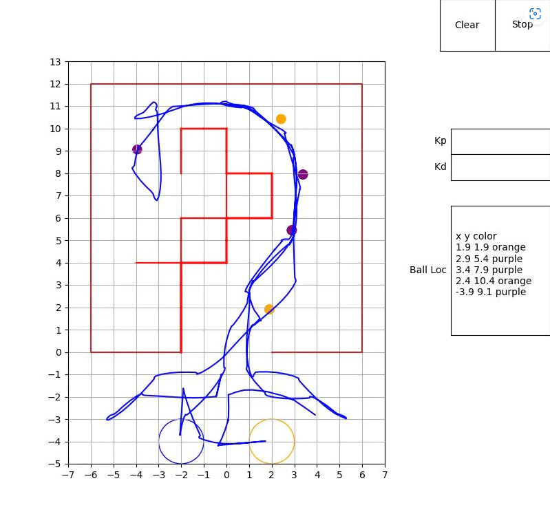

# SE423 Python Interface

### This project is a visulization interface developed for UIUC SE423 course.

### The interface includes:

1. A map for the course where obstacles and golf balls detected will be plotted, as well as the trace of the robot. 

2. Two interactive buttons (Clear and Stop), to clear the path of the robot and stop the GUI.

3. Two interactive text boxes where parameters can be set and send to the robot (Kp and Kd in the picture below). Additional parameters can be added. 

4. A text box to display the locations of the golf balls detected.

### Example:

### Implimentation:

The interface uses the socket library to communicate with the raspberry Pi on the robot through TCP protocal. 

And matplotlib libray to visualize data. 

The buttons and textbox are implemented using matplotlib.widgets. For detailed information on the matplotlib widgets, please visit https://matplotlib.org/stable/api/widgets_api.html.

The data recieved from the raspberry is a string formatted from 8 float numbers:

1. (Float) Robot x position (course coordinates)

2. (Float) Robot y position (course coordinates)

3. (Float) Robot heading angle theta in degrees (course coordinates)

4. (Float) Golf ball x position (course coordinates)

5. (Float) Golf ball y position (course coordinates)

6. (Int) Golf ball color (-1 if not detected)

7. (Float) Obstacle x position (Astar coordinates) (0 if not detected)

8. (Float) Obstacle y position (Astar coordinates) (0 if not detected)
